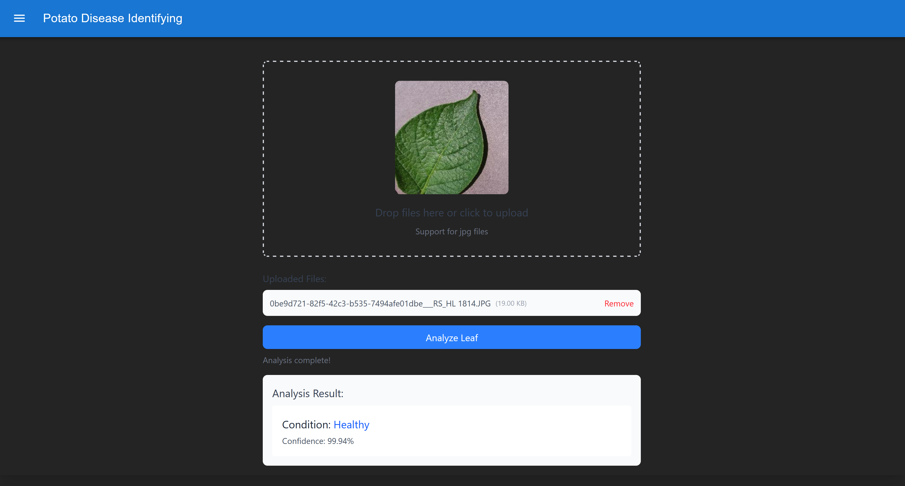

# Potato Disease Identifier

## Overview
The **Potato Disease Identifier** is a web application that uses a TensorFlow model to classify potato leaf diseases. It consists of:
- A **FastAPI backend** for running the machine learning model.
- A **React frontend** for users to upload images and view results.
- Dockerized containers for easy deployment.

## Features
- Upload a potato leaf image for disease identification.
- Get a classification result with confidence score.
- Fully containerized for AWS EC2 deployment.

## Screenshots


## Installation
### Backend (API)
1. Clone the repository:
   ```bash
   git clone https://github.com/your-repo/potato-disease-api.git
   cd potato-disease-api
   ```
2. Install dependencies:
   ```bash
   pip install -r requirements.txt
   ```
3. Run the API:
   ```bash
   uvicorn api.main:app --host 0.0.0.0 --port 8000
   ```

### Frontend
1. Clone the repository:
   ```bash
   git clone https://github.com/your-repo/potato-disease-frontend.git
   cd potato-disease-frontend
   ```
2. Install dependencies:
   ```bash
   npm install
   ```
3. Start the development server:
   ```bash
   npm start
   ```

## Docker Deployment
Docker images have been pushed to Docker Hub for easy deployment:
- **Frontend:** `khangnguyen123/potato-disease-identifier-frontend`
- **Backend:** `khangnguyen123/potato-disease-identifier`

### Deploy on AWS EC2
1. SSH into your EC2 instance.
2. Pull the Docker images:
   ```bash
   docker pull khangnguyen123/potato-disease-identifier
   docker pull khangnguyen123/potato-disease-identifier-frontend
   ```
3. Run the backend container:
   ```bash
   docker run -d -p 8000:8000 khangnguyen123/potato-disease-identifier
   ```
4. Run the frontend container:
   ```bash
   docker run -d -p 3000:3000 khangnguyen123/potato-disease-identifier-frontend
   ```

Your application should now be accessible via `http://<your-ec2-ip>:3000/`.

## License
This project is licensed under the MIT License.

## Acknowledgments
- TensorFlow for deep learning
- FastAPI for backend development
- React for frontend UI

